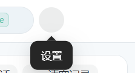

## 问题描述
顶部导航栏中的设置和帮助按钮配色与导航栏背景色相同，导致在未激活状态下按钮几乎不可见，影响用户体验和功能可达性。

## 复现步骤
1. 打开应用主界面
2. 观察顶部导航栏中的设置和帮助按钮
3. 注意在鼠标未悬停时按钮的可见性

## 预期行为
- 设置和帮助按钮即使在未激活状态下也应该清晰可见
- 按钮应有足够的对比度以便用户识别和点击

## 实际行为
- 设置和帮助按钮在未激活状态下与导航栏背景融为一体
- 用户难以发现和点击这些按钮

## 问题截图

## 环境信息
- 操作系统: Windows 10/11, macOS
- 浏览器: Chrome, Firefox, Safari, Edge
- 屏幕分辨率: 各种分辨率